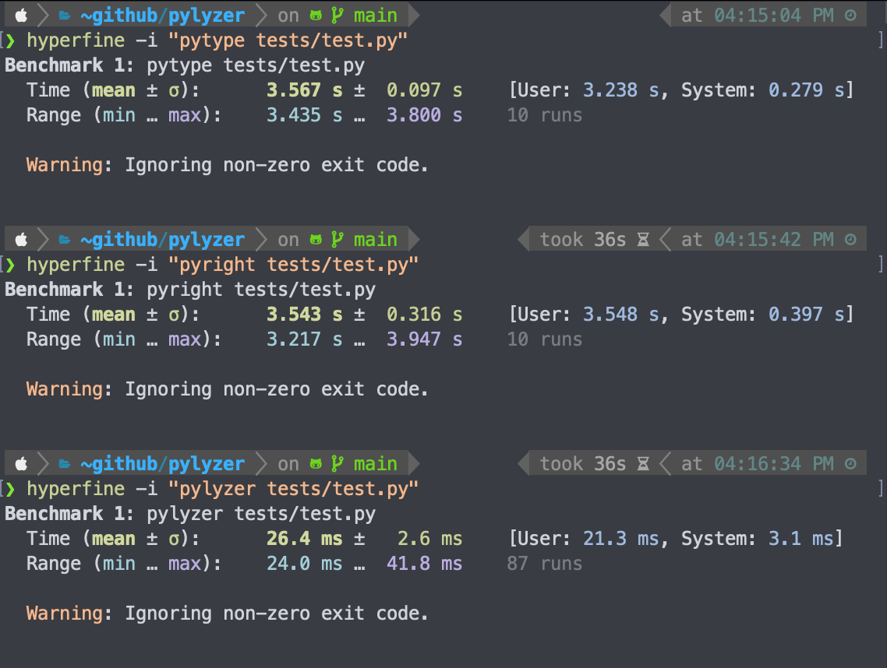
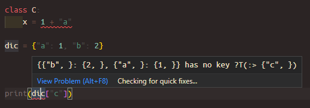

# pype

`pype` is a Python static code analyzer & language server written in Rust.

## Installation

### cargo (rust package manager)

```bash
cargo install pype
```

or download the binary from [the releases page].

## How it works

pype uses the type checker of [the erg programming language](https://erg-lang.org) internally.
This language is a transpiled language that targets Python, and has a static type system.

pype converts Python ASTs to Erg ASTs and passes them to Erg's type checker. It then displays the results with appropriate modifications.

## What is the advantage over pylint, pyright, pytype, etc.?

pype performs type inference of Python source code. Therefore, there is no need to annotate or type your Python scripts in order to use pype. You can, however, explicitly request type checks by specifying types.

There are other softwares that takes the same approach as pype, such as pytype, pyright, etc.

However, pype is superior to them in the following points:

* Performance: pype can inspect Python scripts on average 100 times faster than pytype. This is largely due to the fact that pype is implemented in Rust, whereas pytype is implemented in Python.



* Detailed analysis

pype can do more than the usual type testing. For example, it can detect out-of-bounds accesses to lists and accesses to nonexistent keys in dicts.



* Reports readability: While pytype's error reports are crude, showing only that an error has occurred, pype shows where the error occurred and provides clear error messages.


